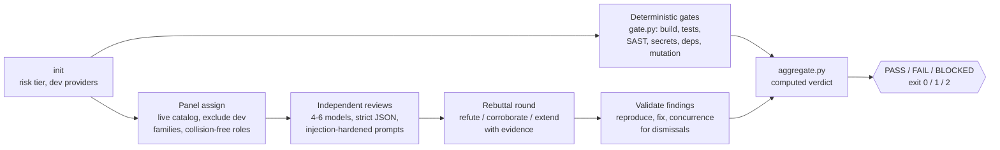
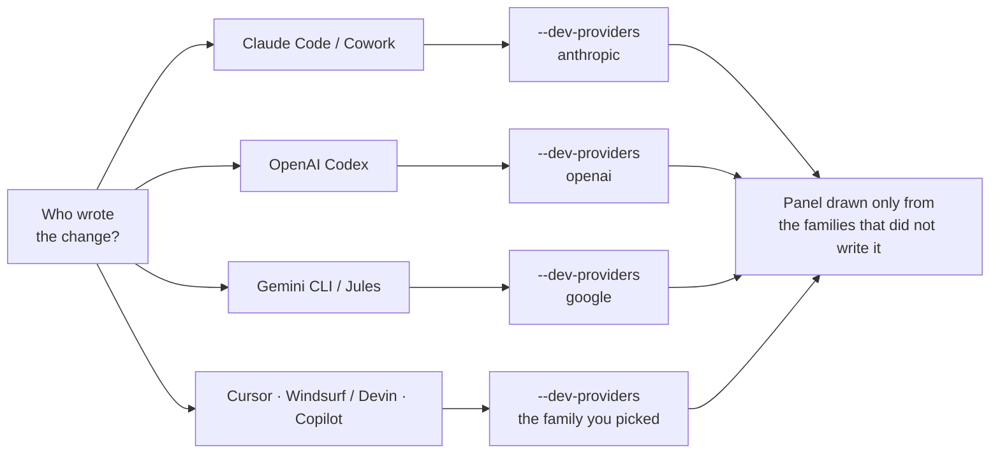

# Adversarial Review

**Multi-model adversarial code review with a deterministic, machine-computed release verdict.**


[](https://github.com/SathiaAI/adversarial-review/actions/workflows/ci.yml)
[](https://sathiaai.github.io/adversarial-review/)
[](LICENSE)


[](https://github.com/SathiaAI/adversarial-review/stargazers)

> **Dogfooded from day one:** every substantive change to this repo has to pass its own
> multi-model panel before it merges — real models, real findings, real verdicts.
> [See the receipts ↓](#proven-on-itself-the-first-real-runs)

A portable agent skill that answers one question honestly: **is this change actually safe to ship?**
It combines deterministic verification (build, tests, SAST, secrets, dependencies, mutation, DAST)
with an independent panel of reviewer models from providers that did **not** write the code —
and the final PASS / FAIL / BLOCKED verdict is computed by a script from recorded artifacts,
never narrated by a model.

Works in **Claude Code**, **Claude (Cowork)**, **OpenAI Codex CLI**, and any agent platform
that reads `SKILL.md` — the scripts are plain Python 3.9+, standard library only.

---

## Why this exists

When an AI model writes code and then reviews its own work, you get the fox auditing the
henhouse. Asking the same model "are you sure?" produces confidence, not verification.
This skill enforces three structural rules instead:

1. **Separation of duties.** Reviewer models are resolved at run time from the router's
   live catalog, and every provider family involved in planning, coding, debugging, or
   advising the change is excluded from the panel. Provider independence is *computed from
   model IDs*, not self-declared.
2. **A deterministic floor.** AI approval can never override a failing build, test, or
   scanner. Every check is recorded as an artifact with an exit code and an explicit
   status (PASS / FAIL / BLOCKED / NOT_APPLICABLE).
3. **A computed verdict.** `aggregate.py` alone emits PASS / FAIL / BLOCKED (exit 0 / 1 / 2)
   from the recorded artifacts. The orchestrating model relays it verbatim. "Never
   reinterpret FAIL as probably-fine" is enforced by architecture, not by asking nicely.

## How it works



Every step writes JSON artifacts to `.adversarial-review/<run-id>/` (gates, reviewer
reports, rebuttals, validation records, suppressions). The aggregator consumes those files
and nothing else — an unrecorded fact does not exist for verdict purposes. Completed runs
are immutable audit records — and provably so: every verdict embeds a **coverage**
manifest of what the run did and did not verify, plus a tamper-evident **attestation**
digest over the entire recorded run
([details ↓](#whats-inside-verdictjson-coverage-and-attestation)).

### The reviewer panel

Roles: **security**, **correctness**, **data/privacy**, **test quality**, **reliability**,
**output-fidelity** (4 roles at NORMAL risk, all 6 at SENSITIVE/CRITICAL). The
output-fidelity reviewer walks the diff line by line and checks that every human-facing
string the code emits states something true — the output-semantics lens (a FAIL message
that claims success, a mislabeled value) that a purely threat/logic panel misses. Each role
goes to a distinct provider family, assigned greedily with collision-free re-solving after
any failure or substitution. Fewer independent families than required → **BLOCKED**, unless
a degraded panel is explicitly authorized on the record.

Reviewers get low temperature, strict JSON schemas (enforced via `response_format:
json_schema` where the endpoint supports it, validated locally always), one retry on
malformed output, and provider substitution on transport failure. Prompts wrap all
repository content in randomized untrusted-data boundaries; content that tries to
instruct the reviewers is itself reported as a high-severity finding. Every reviewer must
attest what it reviewed, what it could not review, its top residual risks, and the
human-facing statements it checked with a truth judgment — a lazy "LGTM" is malformed
output. The output-fidelity reviewer enumerates every such statement; the other roles
report by exception, so a large text diff cannot exhaust the completion cap across the
panel. Any statement a reviewer records as false must be raised as a finding and linked to
it: `aggregate.py` blocks the verdict on a false statement not linked to a triaged finding,
so false human-facing output gates the release deterministically rather than depending on a
reviewer to also remember to file it.

When high/critical findings exist, a **rebuttal round** makes the panel adversarial
rather than merely parallel: reviewers see each other's findings and must refute,
corroborate, or extend them with evidence. Disputes are settled by reproduction, never by
vote.

### What the aggregator refuses to accept

These are tested behaviors, not aspirations (see `tests/run_tests.py`):

| Attempt | Outcome |
|---|---|
| Skip a required gate, or record one without an exit code | BLOCKED |
| Record a gate that couldn't run as "passed" | BLOCKED (`--status BLOCKED` is required honesty) |
| Mark a gate `NOT_APPLICABLE` without a named authorizer and reason | BLOCKED (an inapplicable gate is still accountable) |
| Failing gate anywhere in the required set | FAIL |
| Panel smaller than the tier requires, or a dev-family model on it | BLOCKED |
| Two roles served by the same provider family | BLOCKED |
| High/critical finding with no validation record | BLOCKED |
| Dismiss a high/critical finding without independent concurrence | BLOCKED |
| Concurrence from the finding author's own family or a dev family | BLOCKED |
| "Fixed" without rerunning the affected gates | FAIL |
| Reviewer-flagged release-blocking finding left untriaged (any severity) | BLOCKED |
| Accepted risk without a narrow, owned, unexpired suppression | FAIL |
| Skipping the rebuttal round when policy requires it | BLOCKED |
| Edit, add, or remove any recorded artifact after the verdict is computed | `--check-digest` exits 1 and names each drifted file |

## Proven on itself: the first real runs

This repository is gated by the skill it ships. The first two production runs are public,
linkable, and unedited — the run history *is* the case study.

**Run 1 — the panel found a real bug in its own plumbing.** Reviewing
[PR #1](https://github.com/SathiaAI/adversarial-review/pull/1) (a docs patch) with a live
3-family panel over the Composio MCP transport, both keyless-path reviewers failed strict
JSON validation on their first attempt. Root cause: the MCP tool schema silently strips
`response_format`, so the "provided schema" the prompt referenced never reached the
models. That observation became
[issue #2](https://github.com/SathiaAI/adversarial-review/issues/2) — filed with the
failure evidence and a control group from the same run.

**Run 2 — the skill reviewed its own fix, and pushed back.** The fix for issue #2 went
through the full pipeline in
[PR #3](https://github.com/SathiaAI/adversarial-review/pull/3): five deterministic gates,
then an independent panel of `google/gemini-3.6-flash` (security),
`mistralai/mistral-small-2603` (correctness), and `qwen/qwen3.6-flash` (test quality) —
deliberately the same three models as Run 1, making it a controlled A/B on the fix
itself.

| What happened | Numbers |
|---|---|
| First-attempt schema-valid reviews, before → after the fix | **0/2 → 2/2** |
| Findings raised by the panel against its author's own fix | **7** (3 high, 3 medium, 1 low) |
| Findings that survived triage and forced code/doc/test changes | **6 confirmed** across 3 records — an input guard, a documented prompt-budget policy, and closed test-coverage gaps |
| Findings dismissed | **1**, as an evidence-backed false positive (per-request random boundaries make the claimed collision impossible) |
| The aggregator blocking its own author | **Once** — `BLOCKED: gate plan missing` when the operator skipped `gate.py plan`; the step was completed and re-aggregation earned the PASS |
| Total panel cost | **$0.038** |
| Final verdict, computed by `aggregate.py` | **PASS** (exit 0) — then, and only then, merged |

Three details worth noticing: the panel's high findings were real enough to change the
code; a wrong finding could not be waved away — dismissal required written evidence
against the concrete claim; and the pipeline blocked *its own author* for a process skip
with zero pushback, because the verdict is computed, not negotiated.

## How it compares

| | "Are you sure?" self-review | CI scanners alone | Single-model AI PR bots | **adversarial-review** |
|---|---|---|---|---|
| Reviewer independent of the code's author | ✗ same model | n/a | ✗/partial — one vendor, often the authoring family | ✓ computed from model IDs; authoring families excluded |
| Multiple model perspectives | ✗ | ✗ | ✗ | ✓ 4–6 distinct provider families, per-role rubrics |
| Deterministic floor AI cannot override | ✗ | ✓ | ✗ advisory comments | ✓ gates recorded as artifacts; FAIL is FAIL |
| Final verdict | vibes | per-tool exit codes | prose | ✓ one machine-computed PASS / FAIL / BLOCKED |
| "Couldn't verify" distinct from "passed" | ✗ | ✗ | ✗ | ✓ tri-state; unknown = BLOCKED = unshippable |
| Audit trail | ✗ | partial | vendor-hosted | ✓ immutable JSON artifacts per run |
| Runs in Claude Code / Codex / any SKILL.md agent | — | — | ✗ SaaS | ✓ one folder, stdlib-only Python |

These categories complement each other — keep your scanners; this skill is the layer
that makes their results *and* the AI review converge into one honest verdict.

## Quickstart

```bash
export OPENROUTER_API_KEY=sk-or-...

# from your repository root
python <skill>/scripts/panel.py init --risk SENSITIVE --dev-providers anthropic \
    --diff-ref "main...HEAD" --product "my-service"
python <skill>/scripts/gate.py plan --require build,lint,typecheck,unit,secrets,deps,sast,ai-defects
python <skill>/scripts/gate.py run --name unit -- npm test        # one per gate
python <skill>/scripts/panel.py assign
python <skill>/scripts/panel.py run --context-file context.md      # your diff + context
python <skill>/scripts/panel.py rebuttal                           # when findings exist
python <skill>/scripts/aggregate.py                                # the only verdict
```

`context.md` is the review bundle: requirements, invariants, the full diff, relevant
surrounding code, tests, and migrations. The protocol for assembling it — and for
validating findings afterward — is in [SKILL.md](SKILL.md).

Expected on a first dry run with no gates recorded: **BLOCKED**. That is the system
working — it does not guess.

## Using the skill: step by step

On an agent platform (Claude Code, Cowork, Codex, …) you just invoke the skill and it
drives this whole flow for you — the steps below are what it runs under the hood, and how
to run them by hand. Every command writes JSON into `.adversarial-review/<run-id>/`; only
the last one emits a verdict.

**1 · Install it.** Clone the one folder into your platform's skills directory (see
[Installation](#installation) below), or run the scripts anywhere Python 3.9+ runs.

**2 · Give it reviewer models.** Set `OPENROUTER_API_KEY` — or a key file, an
OpenAI-compatible proxy, or a keyless MCP transport
([Keys and transports](#keys-and-transports)). No key is fine for a first look: the panel
is skipped and the run simply comes back BLOCKED for missing review coverage.

**3 · Start a run.** From your repo root, classify the change and name the families that
wrote it:

```bash
python <skill>/scripts/panel.py init --risk SENSITIVE \
    --dev-providers anthropic --diff-ref "main...HEAD" --product "my-service"
```

`--dev-providers` is every model family that planned, wrote, or advised the change — they
are barred from the panel. The risk tier sets how many reviewers and which gates are
required ([Risk tiers and gates](#risk-tiers-and-gates)).

**4 · Run your gates and record each honestly.** The skill never runs your build or tests
for you; it records their results:

```bash
python <skill>/scripts/gate.py plan --require build,unit,secrets,deps,sast,ai-defects
python <skill>/scripts/gate.py run  --name unit -- npm test          # runs it, records the exit code
python <skill>/scripts/gate.py record --name sast --exit-code 0 --summary "semgrep: 0 findings"  # or ingest a CI result
```

A check that genuinely can't run is `--status BLOCKED`, or `--status NOT_APPLICABLE
--authorized-by "<you>" --summary "<why>"` — never a silent pass.

**5 · Assemble the review context.** Put the requirements and invariants, the full diff,
and the relevant surrounding code into `context.md`. This is exactly what reviewers see —
never include secrets or `.env` content. [SKILL.md](SKILL.md) has the checklist.

**6 · Assign the panel and review.**

```bash
python <skill>/scripts/panel.py assign                        # independent reviewers from the live catalog
python <skill>/scripts/panel.py run --context-file context.md
```

No local key? Swap the second command for `panel.py prepare` → run each request through
your MCP transport → `panel.py ingest --role <role> --response-file <file>`. Same schema,
same validation, same verdict path.

**7 · Rebuttal, when it matters.** If the panel raised high/critical findings,
`python <skill>/scripts/panel.py rebuttal` makes the reviewers confront each other's
findings with evidence (required by policy on SENSITIVE/CRITICAL).

**8 · Validate findings and fix.** For each high/critical or release-blocking finding:
inspect the cited code, reproduce it, fix it, rerun the affected gates, and write a
validation record. Dismissing a finding needs reproducible counter-evidence **and** an
uninvolved reviewer's concurrence — your say-so alone never clears one.

**9 · Get the verdict.** The only step that decides anything:

```bash
python <skill>/scripts/aggregate.py                  # PASS (0) / FAIL (1) / BLOCKED (2), with reasons
python <skill>/scripts/aggregate.py --check-digest   # confirm no artifact changed since
```

Read `verdict.md` (human) or `verdict.json` (machine, carrying the coverage and
attestation blocks). Wire the exit code into CI to gate the merge — and note the skill
itself never merges, pushes, or deploys: the verdict gates those actions, a human
authorizes them.

## Use it on any platform

The pipeline is identical everywhere — Claude Code, Claude (Cowork), OpenAI Codex, Cursor,
Windsurf / Devin, Gemini CLI, GitHub Copilot, or any agent that reads `SKILL.md` or
[`AGENTS.md`](AGENTS.md). Only **two** things change per platform: how you point the agent
at the skill, and **which model family you exclude** — the family that wrote the code.



| Platform | Wire it in | Exclude (`--dev-providers`) |
|---|---|---|
| Claude Code / Cowork | Native skill | `anthropic` |
| OpenAI Codex | `AGENTS.md` or skills dir | `openai` |
| Cursor | `AGENTS.md` | the family you selected |
| Windsurf / Devin | `AGENTS.md` | the family Cascade used |
| GitHub Copilot | `AGENTS.md` + Action | the family in use |
| Gemini CLI / Jules | `AGENTS.md` | `google` |
| Any other agent | `SKILL.md` / `AGENTS.md` | that model's family |

Get the excluded family wrong and the author quietly grades its own work — the one mistake
that turns the whole thing into theatre. **Full per-platform guide** — setup, when to reach
for it, expected outcomes, and what to watch for: the visual guide at
**[sathiaai.github.io/adversarial-review](https://sathiaai.github.io/adversarial-review/)**,
or the same content in [docs/using-on-your-platform.md](docs/using-on-your-platform.md).

## Installation

The whole skill is one folder. `SKILL.md` is the entry point on every platform.

**GitHub Action** — wire the verdict's exit code into CI. The action records
your gate commands through `gate.py`, optionally runs the reviewer panel when
an OpenRouter key secret is provided, and fails the job exactly as
`aggregate.py` decides (PASS/FAIL/BLOCKED = exit 0/1/2), with the verdict
written to the job summary:

```yaml
- uses: SathiaAI/adversarial-review@main
  with:
    gates: |
      build=npm run build
      unit=npm test
    fail-on: fail   # tolerate BLOCKED while adopting; tighten to 'blocked'
    openrouter-api-key: ${{ secrets.OPENROUTER_API_KEY }}
```

Starter workflow: [`examples/adversarial-review.yml`](examples/adversarial-review.yml). On
GitLab, use [`examples/.gitlab-ci.yml`](examples/.gitlab-ci.yml) — same gate-recording and
machine-computed verdict.
Without a key the panel is skipped and the verdict is BLOCKED for missing
panel coverage — the honest verdict for an un-reviewed change, downgradable
to a warning via `fail-on: fail` while wiring up. High/critical findings
still require triage by the operating agent/human; a clean automated PASS
happens when gates pass and the panel raises nothing needing triage.

**CLI (PyPI packaging prepped)** — `pyproject.toml` ships `ar-panel`,
`ar-gate`, `ar-aggregate`, `ar-mcp` console scripts (`python -m build`, then pip/pipx
install the wheel; PyPI publication pending).

**MCP server** — `ar-mcp` (or `python scripts/mcp_server.py`) exposes the pipeline as
MCP tools over stdio, so an MCP host can drive a review directly: `ar_init` →
`ar_gate_plan` → run your gates and record each with `ar_gate_record` → `ar_panel_assign`
→ `ar_panel_prepare`+`ar_panel_ingest` (or `ar_panel_run`) → `ar_aggregate` for the
verdict. It is stdlib-only (no MCP SDK, so the package stays zero-dependency) and
deliberately not an arbitrary-command surface: it records the results of gates you run,
it never executes gate commands itself. Launch it with the repository under review as the
working directory.

**Claude Code / Claude (Cowork)**

```bash
git clone https://github.com/SathiaAI/adversarial-review ~/.claude/skills/adversarial-review
```

**OpenAI Codex CLI** (global, or per-project)

```bash
git clone https://github.com/SathiaAI/adversarial-review ~/.codex/skills/adversarial-review
# or inside a project:
git clone https://github.com/SathiaAI/adversarial-review .agents/skills/adversarial-review
```

Invoke with `$adversarial-review`, browse via `/skills`, or let implicit matching trigger
it. `agents/openai.yaml` provides the Codex display metadata.

**Cursor, Copilot, Antigravity, and other SKILL.md-compatible agents** — clone into the
platform's skills directory; the format is identical. **Any other agent**: point it at
`SKILL.md` as instructions ([AGENTS.md](AGENTS.md) has the short version); the scripts
run anywhere Python 3.9+ runs.

## Keys and transports

Four ways to reach reviewer models, resolved in order (details in
[references/config.md](references/config.md)):

| Option | How | Notes |
|---|---|---|
| OpenRouter key | `OPENROUTER_API_KEY` | Default; full provider routing + privacy controls |
| Key file | `AR_KEY_FILE=~/.config/adversarial-review/key` | Keeps keys out of shell history |
| LiteLLM / any OpenAI-compatible proxy | `AR_BASE_URL` + `AR_API_KEY` | Your own provider keys behind your gateway |
| MCP transport (e.g. Composio), no local key | `panel.py prepare` → execute via MCP → `panel.py ingest` | Same validation and verdict path; see privacy note |

Privacy routing is automatic by risk tier: SENSITIVE requests carry
`data_collection: "deny"`; CRITICAL adds `zdr: true` (zero-data-retention endpoints
only), per OpenRouter's provider routing and ZDR enforcement. MCP transport routes
content through the MCP provider's infrastructure — confirm that is acceptable before
using it for SENSITIVE/CRITICAL changes.

## Risk tiers and gates

| Tier | Panel | Gates |
|---|---|---|
| NORMAL | 4 reviewers | build, format, lint, typecheck, unit, integration, secrets (gitleaks), deps (osv-scanner), SAST (opengrep/semgrep), IaC (checkov), ai-defects |
| SENSITIVE | 6 reviewers | + e2e, migration/rollback tests, changed-scope mutation testing |
| CRITICAL | 6 + rebuttal always in scope | + authorized OWASP ZAP against staging, branch-protection enforcement check |

The **ai-defects** gate is vendor-neutral and runs at every tier — it targets the failure
modes specific to AI-written code: phantom references and invented package APIs, impossible
dependency versions, and unfinished stubs left behind as if complete. It behaves like any
other gate (unavailable tooling is recorded BLOCKED or waived on the record, never
silenced); details in [`references/gates.md`](references/gates.md).

Mutation testing is scoped to changed code (Stryker `--incremental`, PIT incremental
analysis, path-scoped mutmut) so the gate survives real repositories. A minimum gate
floor per tier cannot be silently dropped — only waived on the record with a named
authorizer, which the verdict surfaces.

A gate that genuinely doesn't apply to a stack (a config-only repo has no build to run,
no unit suite to execute) is recorded `--status NOT_APPLICABLE --authorized-by "<user>"
--summary "<why>"`. Unlike BLOCKED it does not restrict the verdict — a genuinely
config-only repo can reach a clean PASS — but it is accountable, not a self-service skip:
the aggregator BLOCKS an N/A record missing an authorizer or reason, and every N/A gate is
listed with its authorizer in the verdict. It tells a human skimming verdicts "nothing to
run here" apart from BLOCKED's "something should exist but couldn't be verified."

**Rebuttal policy** (`--rebuttal-policy` at init, or `AR_REBUTTAL`): `critical` |
`contention` (default: SENSITIVE + CRITICAL) | `any`. In every mode the round only runs
when there are high/critical findings to contest — cost scales with contention.

## Verdict semantics

- **PASS** (exit 0) — every tier-required gate recorded and passing; panel complete and
  provably independent; every high/critical or release-blocking finding validated with a
  compliant record.
- **FAIL** (exit 1) — a recorded gate failed, or a confirmed-unfixed / unresolved /
  improperly-accepted finding exists.
- **BLOCKED** (exit 2) — required verification is missing or incomplete. BLOCKED is not
  "probably fine"; it means *you do not know*. The gate treats unknown as unshippable.

Wire it into CI: run the aggregator as the last step and let the exit code gate the
deploy. `verdict.json` (machine) and `verdict.md` (human) land in the run directory.

### What's inside verdict.json: coverage and attestation

Beyond the verdict itself, every aggregation embeds two blocks that make the audit
record self-describing and self-verifying:

```jsonc
"coverage": {                       // what this run did and did not verify
  "risk": "NORMAL",
  "gates": {"plan_recorded": true, "required": [...], "passed": [...],
            "failed": [], "blocked": [], "missing": [], "waived": [...]},
  "panel": {"roles_required": [...], "roles_filled": [...],
            "degraded": null, "dev_families_excluded": ["anthropic"]},
  "rebuttal": {"policy": "contention", "required": false, "ran": false},
  "findings": {"raised": 8, "triaged": 8, "untriaged_release_blocking": 0},
  "areas_not_reviewed": ["union of the reviewers' own attestations"]
},
"attestation": {                    // tamper-evident digest over the recorded run
  "algorithm": "sha256-canonical-json-v1",
  "inputs": 27,
  "digest": "1f58da91…",
  "files": {"run.json": "…", "gates/unit.json": "…"}
}
```

**Coverage** is assembled exclusively from recorded artifacts — the same inputs as the
verdict — so an unrecorded fact is absent here too, never inferred. It is present on
every aggregation, including FAIL and BLOCKED; CI consumers can read `gates.missing`,
`gates.blocked`, and `rebuttal {"required": true, "ran": false}` as the specific
unknowns behind a BLOCKED verdict.

**Attestation** is a reproducible SHA-256 over every recorded `*.json` artifact except
`verdict.json` itself. Artifacts are canonicalized (sorted keys, compact separators),
so cosmetic re-serialization is not tampering, while a file that fails UTF-8 decoding
or JSON parsing hashes over its raw bytes instead of crashing the aggregator.
Re-aggregating an untouched run reproduces the digest bit-for-bit, and anyone holding
the run directory can verify it:

```bash
python scripts/aggregate.py --check-digest
# exit 0 — intact.  Output: "attestation OK: sha256 1f58da91… over 27 artifacts"
# exit 1 — drifted. One line per drifted artifact, e.g. "  DRIFT modified gates/deps.json"
# exit 2 — nothing to verify yet (no verdict.json, or one computed before attestations existed)
```

## Configuration

### Policy as code

Review standards can be versioned with the code they govern. Drop
`.adversarial-review.yml` (or `.adversarial-review.json`) at the repo root and
`panel.py init`, `gate.py plan`, and `panel.py assign` read it as defaults —
reviewable, diffable, and consistent across operators and sessions:

```yaml
risk: SENSITIVE            # default tier for this repo
dev_providers: [anthropic] # always-excluded families
rebuttal_policy: contention
required_gates:
  NORMAL: [build, unit, secrets, deps, sast]
  SENSITIVE: [build, unit, secrets, deps, sast, mutation]
pins: {}                   # role: provider/model-slug
```

Precedence is always **CLI flag > env var > policy file > built-in default**, and
every resolved value's source (`cli|env|policy|default`) is recorded into the run's
artifacts — `run.json` carries a `sources` block plus the policy file's sha256, and
the exact policy text is snapshotted into the run where the attestation digest
covers it. A missing file changes nothing; a malformed file is a loud error, never a
silent fallback; tier floors are always unioned in — a policy can add gates, never
remove floors. The YAML parser is a strict stdlib-only subset (scalars, lists, one
nested mapping level, comments; no coercion — scalars stay strings); anything richer
belongs in the JSON variant. This repo [reviews itself](.adversarial-review.yml)
through one. Details in [`references/config.md`](references/config.md).

### Environment variables

| Variable | Default | Purpose |
|---|---|---|
| `OPENROUTER_API_KEY` | — | Direct OpenRouter credential |
| `AR_KEY_FILE` | — | Path to a file containing the key |
| `AR_BASE_URL` | `https://openrouter.ai/api/v1` | Any OpenAI-compatible router |
| `AR_API_KEY` | — | Key for `AR_BASE_URL` |
| `AR_TRANSPORT` | auto | `http` or `mcp` |
| `AR_PRIVACY` | by tier | `default`, `deny`, `zdr` |
| `AR_TEMPERATURE` | `0.1` | Reviewer sampling temperature |
| `AR_MAX_TOKENS` | `8000` | Reviewer response cap |
| `AR_TIMEOUT_S` | `240` | Per-request timeout |
| `AR_RUN_DIR` | `.adversarial-review` | Artifact root |
| `AR_RISK` | — | Default risk tier for `init` |
| `AR_DEV_PROVIDERS` | — | Comma list of dev families for `init` |
| `AR_REQUIRE` | — | Comma list of gates for `plan` |
| `AR_PINS` | — | `role=provider/model-slug` overrides |
| `AR_REBUTTAL` | `contention` | Rebuttal policy |

No model IDs are hardcoded anywhere: reviewers resolve from the router's live `/models`
catalog at run time (floating aliases, `:free` routes, and previews are filtered out),
and the exact resolved IDs are pinned into the run's `plan.json` for the audit record.

## Testing

```bash
python tests/run_tests.py
```

End-to-end scenarios against an in-process mock router — no network, no API keys:
role assignment and collision-resolution under multi-provider exclusions, degraded-mode
authorization, malformed-JSON retry, dead-provider substitution, the full verdict matrix,
rebuttal policies, suppression expiry, the keyless MCP prepare/ingest path, policy-file
precedence, source recording, and malformed-policy refusal, the coverage and attestation
blocks, and the stdio MCP server end to end (protocol handshake, run-id and catalog_file
hardening, the parse-error and subprocess-timeout paths, and all three verdict states).
CI runs the suite on Python 3.9 and 3.12.

## Repository layout

```
SKILL.md              # canonical protocol (all platforms)
AGENTS.md             # condensed instructions for AGENTS.md-reading agents
.adversarial-review.yml  # policy as code: this repo's own review defaults
CONTRIBUTING.md       # dev setup, ground rules, how PRs get (adversarially) reviewed
SECURITY.md           # how to report vulnerabilities, incl. prompt-injection bypasses
agents/openai.yaml    # Codex display metadata
scripts/
  panel.py            # catalog resolution, role assignment, reviewer calls, rebuttal, concurrence
  gate.py             # deterministic gate runner/recorder (tri-state: PASS/FAIL/BLOCKED)
  aggregate.py        # the only thing that can emit a verdict
  mcp_server.py       # stdio JSON-RPC MCP server exposing the pipeline as MCP tools
  _common.py          # shared stdlib-only helpers (router client, catalog, artifacts)
references/
  config.md           # keys, transports, privacy, env vars
  gates.md            # gate matrix, thresholds, suppression rules, supply-chain hygiene
  roles.md            # role rubrics, prompt contract, injection defense
  schemas.md          # artifact schemas and blocking rules
  report.md           # final report template
tests/                # mock router + end-to-end suite (see tests/run_tests.py)
```

## Security notes

Repository content shown to reviewers is delimited as untrusted data with per-run
randomized boundaries; prompt-injection attempts are reported as findings (see OWASP's
LLM Top 10, LLM01). Secrets, `.env` files, and production data must never enter review
context or artifacts. The skill never merges, pushes, publishes, or deploys — verdicts
gate those actions, humans authorize them.

## Contributing

Contributions welcome — [CONTRIBUTING.md](CONTRIBUTING.md) has the five-minute setup
(no dependencies to install) and the ground rules. The short version: run the test
suite, keep the scripts stdlib-only, and pair any verdict-semantics change with a
regression test. Substantive PRs are reviewed the only way this repo knows how: by an
independent multi-model panel, with the verdict computed. Security reports:
[SECURITY.md](SECURITY.md) — prompt-injection bypasses of the review boundaries are
explicitly in scope and especially welcome.

## License

[MIT](LICENSE) © 2026 SathiaAI.
