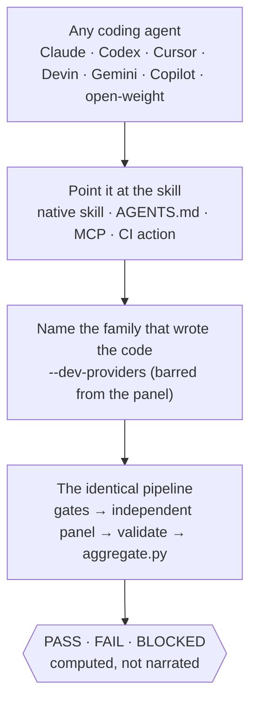
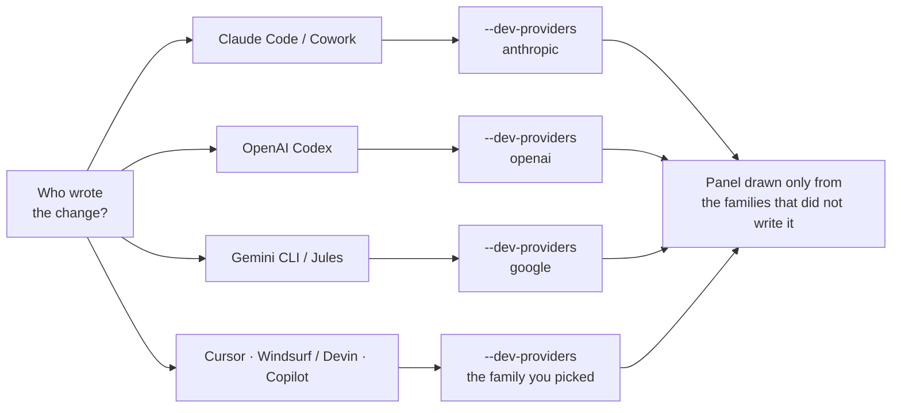
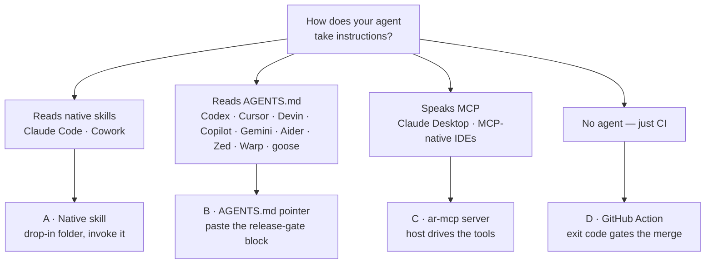

# Using adversarial-review on your platform


A field guide to running the skill wherever you code — Claude Code, Claude (Cowork),
OpenAI Codex, Cursor, Windsurf / Devin, GitHub Copilot, Gemini CLI, and any other
agent — plus **when** to reach for it, **what** you'll get, **what to watch for**, and
**how to get the most value**.

---

## The one idea that makes it work everywhere

The skill doesn't care which agent runs it. It's a `SKILL.md` and a handful of
**zero-dependency Python 3.9+ scripts** — no SDK, no service. Any agent that can (1) read
instructions and (2) run shell/Python can operate the whole pipeline.

So "which platform" only changes **two** things:

1. **How you point the agent at it** — a native skill, an `AGENTS.md` pointer, an MCP
   server, or a CI action (pick one below).
2. **Which model family you exclude from the panel** — the family that *wrote* the code.
   This is the entire point: a model reviewing its own work is the fox auditing the
   henhouse. You tell the pipeline who wrote it with `--dev-providers`, and those families
   are barred from the reviewer panel.

Everything else — the deterministic gates, the independent panel, the computed
PASS/FAIL/BLOCKED verdict — is identical on every platform. You also need reviewer-model
access once (an OpenRouter key, an OpenAI-compatible proxy, or an MCP transport).



### The exclusion cheat-sheet (the thing people get wrong)

Match `--dev-providers` to whoever wrote the change on that platform:

| You're coding in… | Default model family | Pass `--dev-providers` |
|---|---|---|
| Claude Code / Claude (Cowork) | Anthropic (Claude) | `anthropic` |
| OpenAI Codex | OpenAI (GPT) | `openai` |
| Windsurf / Devin (Cognition) | usually Anthropic or OpenAI | the family you selected (e.g. `anthropic` or `openai`) |
| Cursor | whatever model you picked | that family (`anthropic` / `openai` / `google`) |
| GitHub Copilot | usually OpenAI or Anthropic | the family in use |
| Gemini CLI / Jules (Google) | Google (Gemini) | `google` |



If two people (or two agents) touched it, list every family: `--dev-providers anthropic,openai`.
When in doubt, over-exclude — a smaller-but-cleaner panel beats a compromised one. (If too
few independent families remain, the run comes back **BLOCKED** on purpose, not a soft pass.)

---

## Four ways to wire it in — pick per platform



**A · Native skill** — *Claude Code, Claude (Cowork).* Skills are first-class. Drop the
folder in the skills directory and invoke it; the agent reads `SKILL.md` and runs the
pipeline for you.

```bash
git clone https://github.com/SathiaAI/adversarial-review ~/.claude/skills/adversarial-review
```

**B · `AGENTS.md` pointer** — *Codex, Cursor, Windsurf/Devin, Copilot, Gemini CLI, Aider,
Zed, Warp, goose, Amp, and 60k+ other repos' agents.* These read
[AGENTS.md](https://agents.md). Clone the scripts and add a short block telling the agent
to run the review before it declares a change "done":

```markdown
## Release gate (adversarial-review)
Before calling any change done, run the adversarial-review pipeline in
tools/adversarial-review/ per its SKILL.md: init (risk tier + --dev-providers = THIS
agent's model family), record the gates, run the independent panel, and aggregate.
Relay the verdict from aggregate.py verbatim — never reinterpret FAIL/BLOCKED as "probably fine."
```

**C · MCP server** — *any MCP host (Claude Desktop, IDEs with MCP, custom hosts).* Run
`ar-mcp` (or `python scripts/mcp_server.py`) with the repo under review as the working
directory; the host drives the review through MCP tools (`ar_init`, `ar_gate_record`,
`ar_panel_*`, `ar_aggregate`, …). Stdlib-only, and deliberately **not** an
arbitrary-command surface — it records gate results, it never runs your gate commands
itself.

**D · CI / GitHub Action** — *no agent at all.* Wire the verdict's exit code into the
pipeline so it gates the merge, not a human's optimism:

```yaml
- uses: SathiaAI/adversarial-review@main
  with:
    gates: |
      build=npm run build
      unit=npm test
    fail-on: fail            # tolerate BLOCKED while adopting; tighten to 'blocked' later
    openrouter-api-key: ${{ secrets.OPENROUTER_API_KEY }}
```

The Action and a mirrored **GitLab CI** template — the full input reference, the
Action-input↔GitLab-variable mapping, and the manual GitHub Marketplace publishing steps — are
covered in [ci-integration.md](ci-integration.md).

### Using the MCP server (`ar-mcp`) — for MCP hosts

**When to reach for it.** If your host natively runs *skills* (Claude Code, Claude Cowork), use path A above — you don't need the MCP. Reach for `ar-mcp` when your host speaks **MCP** but not skills: **Claude Desktop**, MCP-native IDEs like **Cursor** and **Windsurf**, or **your own agent** (a LangChain / LlamaIndex / custom loop) that should drive the review as first-class tool calls instead of shell commands.

**What it exposes.** Ten tools over newline-delimited **JSON-RPC 2.0 on stdio** — `ar_init`, `ar_gate_plan`, `ar_gate_record`, `ar_panel_assign`, `ar_panel_prepare` + `ar_panel_ingest` (or `ar_panel_run`), `ar_aggregate`, `ar_check_digest`, `ar_get_verdict`. It is stdlib-only, and the verdict is still computed **only** by `aggregate.py`. Crucially it is *not* a command-execution surface: it **records** the results of gates you run and never executes an arbitrary command itself — which is what makes it safe to hand to an autonomous agent.

**How the host drives it.** `ar_init` -> `ar_gate_plan` -> run your gates and `ar_gate_record` each -> `ar_panel_assign` -> `ar_panel_prepare` + `ar_panel_ingest` (or `ar_panel_run`) -> `ar_aggregate` for the verdict. Launch the server with the repository under review as its working directory — it reads and writes `.adversarial-review/` in `cwd`.

**Adding it to an MCP host.** A standard `mcpServers` entry:

```json
{
  "mcpServers": {
    "adversarial-review": {
      "command": "ar-mcp",
      "args": [],
      "cwd": "/path/to/your/repo"
    }
  }
}
```

Use `"command": "python", "args": [".../adversarial-review/scripts/mcp_server.py"]` if you did not install the console script. Add your router key to `env` only if you want the server to call reviewers itself (`ar_panel_run`); otherwise use the keyless `ar_panel_prepare` + `ar_panel_ingest` path and let the host's own transport make the calls. In **Claude Desktop** add it under Settings -> Extensions (or the config file); in **Cursor / Windsurf / Claude Code** use that tool's MCP config.

**The Claude Cowork caveat.** Cowork's custom connectors are **remote-MCP only** — an HTTPS URL brokered through your Claude account, not a local stdio process — so `ar-mcp` is *not* the way into Cowork. There, use the **native skill** (path A). If you specifically need `ar-mcp` in Cowork, host it as a *remote* MCP endpoint (wrap the stdio server behind an HTTP transport) and add its URL under Customize -> Connectors.

**Standards.** `ar-mcp` is **dual-era**. It speaks the current **MCP `2026-07-28`** revision — the stateless model where each request carries its own protocol version and capabilities in `_meta`, with no session — *and* still answers the legacy `initialize` handshake (`2025-06-18` and earlier), so both old and new hosts drive the same binary. On `2026-07-28` it implements the stdio server surface the spec requires: `server/discover`, per-request version negotiation (an unsupported version returns `UnsupportedProtocolVersion`, `-32022`), the mandatory `resultType`, and `tools/list` cache hints (`ttlMs` / `cacheScope`). Still on the roadmap is the **Streamable-HTTP transport** — the piece a *remote* host needs (a hosted endpoint, or Claude Cowork's remote-only connectors); until then `ar-mcp` is a local **stdio** server. Governance of MCP moved to the Linux Foundation's **[Agentic AI Foundation](https://www.linuxfoundation.org/press/linux-foundation-announces-the-formation-of-the-agentic-ai-foundation)** (Dec 2025) — neutral stewardship, distinct from the spec — as did [`AGENTS.md`](https://agents.md), the other standard this guide leans on.

---

## Per-platform playbook

### Claude Code — *the reference experience*
- **Setup:** native skill (path A). `export OPENROUTER_API_KEY=…`.
- **When:** pre-merge gate on a feature branch you (and Claude) just built; "is this safe
  to ship?" before you open the PR.
- **Exclude:** `anthropic`.
- **Outcome:** the full pipeline end-to-end and a computed verdict, run by the agent that
  wrote the code — which is exactly why the verdict is *computed*, not narrated.
- **Watch for:** Claude is the author **and** the operator here, so the independence has to
  come from the panel — keep `--dev-providers anthropic` and don't let it "explain away" a
  finding. Set an `OPENROUTER_API_KEY` (or key file).
- **Maximize:** add `aggregate.py` to a pre-push hook so a FAIL/BLOCKED actually stops the
  push.

### Claude (Cowork) — *reviews that produce a shareable artifact*
- **Setup:** native skill; runs in the cloud sandbox.
- **When:** review a branch/PR and hand a stakeholder a **verdict + report** they can read
  — not just a green check.
- **Exclude:** `anthropic`.
- **Outcome:** `verdict.json` (machine) + `verdict.md` (human) + the full run directory,
  attested. Great for "prove it's done," audits, and demos.
- **Watch for:** with no local key, use the MCP transport (e.g. Composio) — content then
  routes through that provider, so confirm that's acceptable for SENSITIVE/CRITICAL code.
  Cowork's cloud git can't push to arbitrary repos; land results via your normal PR flow.
- **Maximize:** save the run's report alongside the PR as the audit trail.

### OpenAI Codex — *AGENTS.md-native*
- **Setup:** path B (AGENTS.md) or clone into the Codex skills dir; `AGENTS.md` is honored.
- **When:** gate a Codex-built change before it's merged.
- **Exclude:** `openai` (Codex is GPT). Make sure the panel still has ≥3 non-OpenAI
  families for NORMAL, ≥5 for SENSITIVE/CRITICAL.
- **Outcome:** same computed verdict; the panel is genuinely independent of GPT.
- **Watch for:** the most common miss is forgetting to exclude `openai` — then GPT is
  reviewing GPT. Also give Codex the *diff*, not the whole repo, in `context.md`.
- **Maximize:** put the `AGENTS.md` release-gate block in the repo so every Codex session
  gates itself the same way.

### Windsurf / Devin (Cognition) — *autonomous agent that runs itself*
- **Setup:** path B. Windsurf is now **Devin Desktop**; the **Cascade** agent reads
  `AGENTS.md` and runs terminal commands, so it can drive the whole pipeline unattended.
- **When:** Devin/Cascade builds a feature autonomously → have it gate its **own** work
  before it opens a PR. This is the highest-leverage case: an autonomous agent that must
  prove, not assert, that its output is safe.
- **Exclude:** the family Cascade/Devin used (commonly `anthropic` or `openai` — whichever
  you configured).
- **Outcome:** an autonomous build **plus** an independent, computed release gate on it.
- **Watch for:** autonomy amplifies the self-review trap — pin `--dev-providers` in
  `AGENTS.md` so the agent can't quietly review itself; and because Cascade runs commands
  itself, prefer the record-gates path (it records results; it doesn't need a
  command-execution surface).
- **Maximize:** make the verdict a hard stop in the agent's workflow — no green verdict, no
  PR.

### Cursor — *model-agnostic IDE*
- **Setup:** path B (`AGENTS.md`; legacy `.cursorrules` also works).
- **When:** gate a change before you accept Cursor's edits into `main`.
- **Exclude:** **whatever model you selected** in Cursor — `anthropic`, `openai`, or
  `google`. This is easy to get wrong because you can switch models mid-session.
- **Outcome:** same verdict; reviewers are distinct from your chosen coding model.
- **Watch for:** if you switched models while building, exclude **all** families you used.
- **Maximize:** keep review standards consistent with a repo-level `.adversarial-review.yml`
  so every teammate's Cursor session gates identically.

### GitHub Copilot (coding agent) — *PR-native*
- **Setup:** path B (`AGENTS.md`) for the coding agent; path D (Action) for the CI gate.
- **When:** on the PR the Copilot agent opens.
- **Exclude:** the family Copilot used (often `openai` or `anthropic`).
- **Outcome:** the verdict posts as the gating status on the PR.
- **Watch for:** let the **Action** compute the verdict in CI rather than trusting the
  agent's prose summary of its own change.
- **Maximize:** required status check = the aggregator's exit code.

### Gemini CLI / Jules (Google) — *AGENTS.md-native*
- **Setup:** path B.
- **Exclude:** `google`.
- **Watch for / Maximize:** same pattern — exclude Gemini, keep the panel diverse, gate on
  the exit code.

### Aider, Zed, Warp, goose, Amp, RooCode, and other AGENTS.md agents
- **Setup:** path B — they all read `AGENTS.md`.
- **Exclude:** the model family that agent is driving.
- Everything else is identical; the skill is deliberately boring across tools.

### Any other agent — including open-weight setups (e.g. Hermes/Nous, Llama, Qwen)
- **Setup:** if it reads `AGENTS.md`, path B; otherwise paste `SKILL.md` (or
  [AGENTS.md](https://github.com/SathiaAI/adversarial-review/blob/main/AGENTS.md)) in as
  instructions and let it run the scripts. Anything with Python 3.9+ and a shell works.
- **Exclude:** the open model's family (so it doesn't grade itself).
- **Bonus angle:** open-weight models like the **Hermes** family are also useful *on the
  panel* — they add provider diversity as reviewers via OpenRouter, which is exactly what
  independence wants. (If by "Hermes" you meant a specific tool rather than the model
  family, tell me and I'll add a tailored card.)

---

## Use cases: when to reach for it (any platform)

- **Gate an AI-written PR before merge.** The more of the change an agent wrote, the more
  you need a reviewer that *isn't* that agent. This is the core case.
- **Risky changes → raise the tier.** Auth/authz, payments, personal data, tenant
  isolation, migrations, infra → `--risk SENSITIVE` (6 reviewers); add irreversibility or
  blast radius → `CRITICAL` (adds an always-on rebuttal round + enforcement checks).
- **"Is it actually done?"** When you want *proof* rather than an agent's assurance — the
  attested run directory is the proof.
- **Release gate before deploy.** Run the aggregator as the last CI step; the exit code
  gates the deploy.
- **Catch AI-specific defects.** The `ai-defects` gate targets phantom references, invented
  package APIs, impossible dependency versions, and unfinished stubs — the failure modes
  that generated code produces and humans skim past.

## Outcomes you can expect (honestly)

- **A computed verdict, not a vibe:** PASS (exit 0) / FAIL (1) / BLOCKED (2), from recorded
  artifacts, relayed verbatim.
- **Real findings from models that didn't write the code** — and, when high/critical
  findings exist, a rebuttal round where reviewers confront each other with evidence.
- **BLOCKED when review is incomplete** — unknown is treated as unshippable, so you won't
  get false confidence from a half-run.
- **A tamper-evident audit trail** — coverage + attestation in every `verdict.json`,
  verifiable with `aggregate.py --check-digest`.
- **Cost:** typically a few cents of reviewer tokens per run (it reports usage).
- **What it is *not*:** a replacement for your scanners or your own judgment. It's the layer
  that makes their results *and* an independent AI review converge into one honest verdict.

## What to watch for (the real gotchas)

1. **Never let the authoring family review itself.** Set `--dev-providers` correctly — this
   is 90% of getting value. Wrong exclusion = theatre.
2. **The operator is a conflicted party.** The agent running the review often *is* the
   author. That's by design safe *only because the verdict is computed by `aggregate.py`,
   not narrated by the model.* Don't let an agent "interpret" a FAIL into a pass.
3. **Transport privacy.** Direct OpenRouter supports privacy routing by tier
   (SENSITIVE→data-collection deny, CRITICAL→ZDR). An **MCP transport routes your code
   through that provider** — fine for NORMAL, confirm before SENSITIVE/CRITICAL. Never put
   secrets, `.env`, or production data in `context.md`.
4. **Independence needs enough families.** Too few distinct non-dev families → BLOCKED (a
   smaller panel requires explicit, recorded authorization). That's the system protecting
   you, not failing.
5. **Feed it the diff, not the repo.** Give it `main...HEAD` plus the surrounding code that
   matters — not a 200-file dump.
6. **Don't move the goalposts.** Weakening a gate, threshold, or scanner rule to get a pass
   defeats the whole thing (and the aggregator resists it — waivers must be on the record
   with a named authorizer).

## How to maximize value

- **Use it as a gate, not a suggestion.** Wire `aggregate.py`'s exit code into a pre-push
  hook or a required CI check. A verdict nobody enforces is a comment.
- **Version your standards.** Drop a `.adversarial-review.yml` at the repo root so risk
  tier, excluded families, required gates, and rebuttal policy are identical across every
  operator, agent, and platform — reviewable and diffable like code.
- **Classify risk honestly.** The tier drives how hard it looks; calling an auth change
  NORMAL is how things slip through.
- **Keep the panel diverse.** More distinct provider families = more independent
  perspectives. Pin them per-run if you want determinism.
- **Keep the artifacts.** The attested run directory is your audit trail — check the digest
  before you trust a verdict you didn't just compute.
- **Point it at the highest-leverage moment:** the instant an agent says "done." That claim
  is precisely what this exists to verify.

---

*The pipeline is identical everywhere; only the wiring and the excluded family change. If
your platform reads `AGENTS.md`, you're already 90% set up.*
